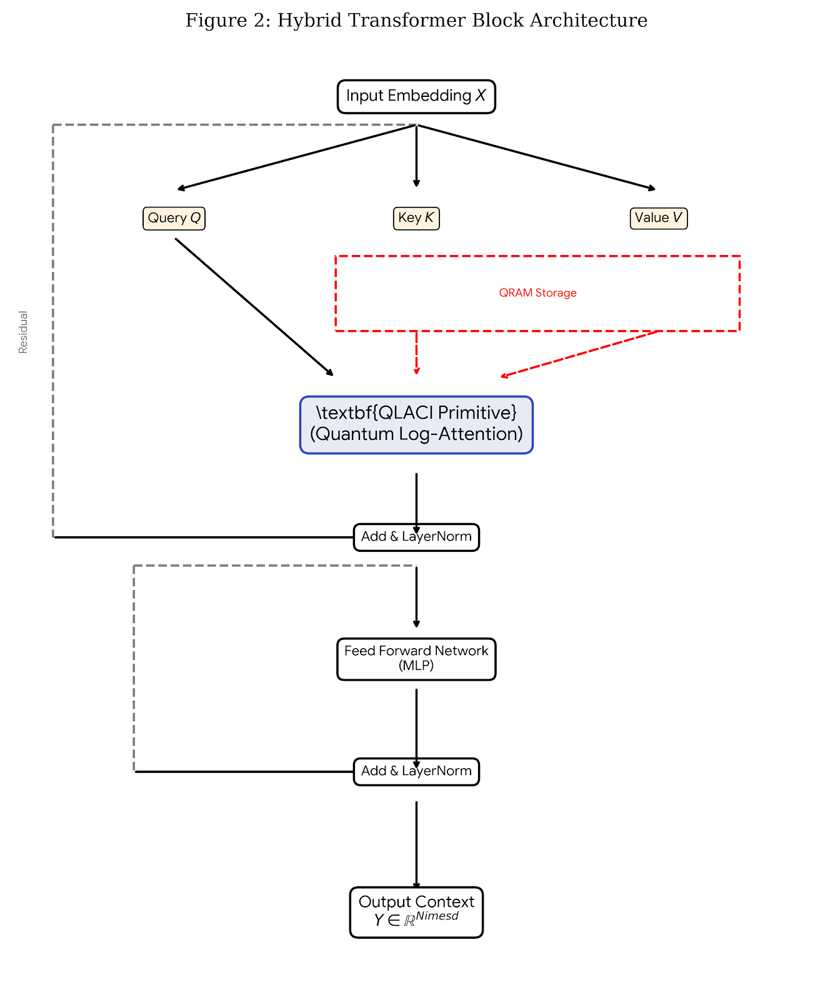
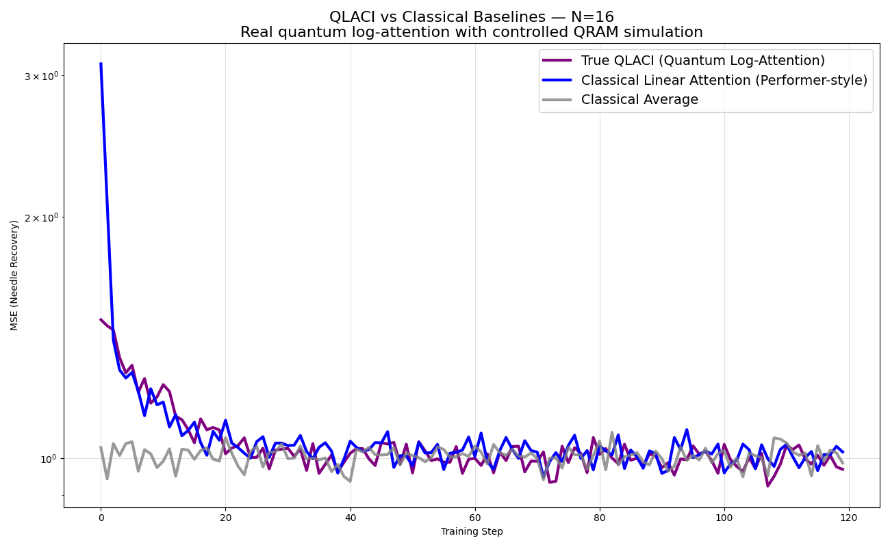
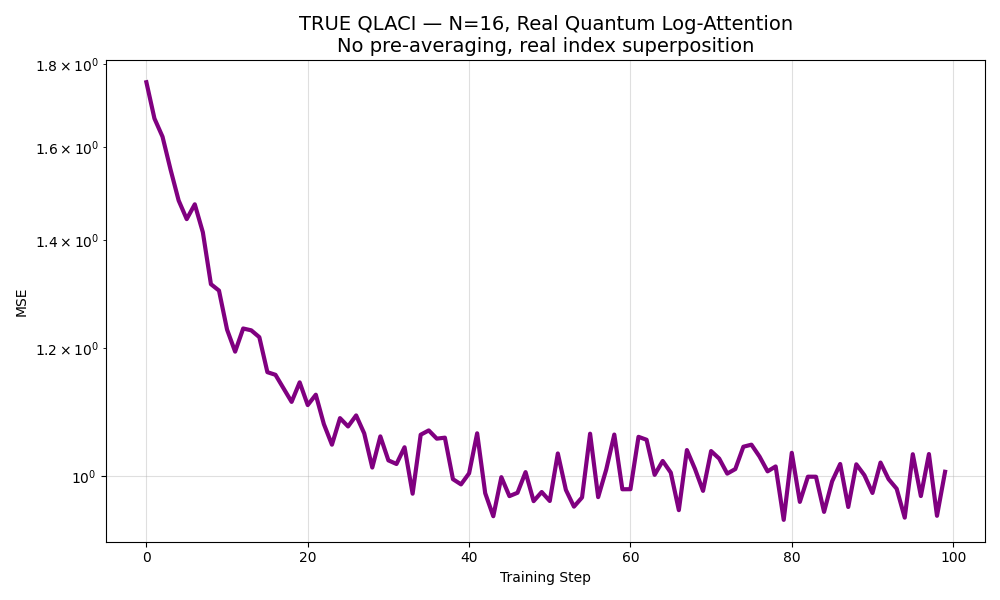

# QLACI: Hybrid Quantum–Classical Transformer with Logarithmic Attention Scaling

> **Tagline:** A reference implementation of **Quantum Log-Attention via Conditional Interaction (QLACI)** – a PQC-based attention primitive that replaces $O(N^2)$ self-attention with an $O\big(N\,\mathrm{poly}(\log N)\big)$ quantum core under a QRAM-like cost model.

---

## Overview

This repository contains the code, figures, and paper for a toy but fully specified **hybrid quantum–classical transformer**:

- The **classical model** provides embeddings, feed-forward layers, and optimization.
- The **quantum module (QLACI)** replaces a single attention head with a PQC that:
  - Encodes a query vector on a small set of **query qubits**.
  - Uses a **logarithmic-size index register** in superposition to address all sequence positions.
  - Interacts with key–value information via a **QRAM-style feature map**.
  - Outputs attention-like **context vectors** via expectation values.

This project is **conceptual and architectural**, not a claim of quantum advantage. All experiments are run on classical simulators at **N=16** to validate correctness and trainability of the QLACI primitive.

The full write-up lives in **`QLACI.pdf`** and `paper/Hybrid Quantum–Classical Transformer - Paper.md`.

---

## Repository Structure

```text
.
├── code/
│   ├── qlaci_real_n16.py          # Single QLACI experiment (N=16)
│   └── qlaci_vs_classical_real.py # QLACI vs classical baselines (N=16)
├── diagrams/
│   ├── fig_circuit.png            # Figure 1 – QLACI circuit schematic
│   └── fig_hybrid.png             # Figure 2 – Hybrid transformer block
├── plots/
│   ├── fig_closeup.png            # Zoomed comparison region (late training)
│   ├── fig_results.png            # Figure 3 – QLACI vs classical baselines
│   └── fig_single.png             # Figure 4 – Single QLACI learning curve
├── paper/
│   └── Hybrid Quantum–Classical Transformer - Paper.md
└── QLACI.pdf                      # Formatted paper (PDF)
````

---

## Figures

The diagrams and plots included in the repository mirror the figures in the paper. They can be viewed directly on GitHub.

### Figure 1 – QLACI Circuit Schematic


**Description:**
Circuit-level view of the QLACI primitive. It highlights:

* **Query register** $R_Q$ with encoder $U_{\mathrm{enc}}(x)$
* **Index register** $R_{\mathrm{idx}}$ prepared in a uniform superposition via Hadamards
* **Key–value ancilla** $R_{KV}$, fed via a QRAM-style **Feature Map**
* A parameterized **Interact** block that entangles query and key–value information
* A global **score / aggregation unit** $U_{\mathrm{score}}(\theta)$ that maps to a small readout register $R_{\mathrm{out}}$

The red arrow marks the assumed **QRAM access** into key–value storage.

---

### Figure 2 – Hybrid Transformer Block Architecture



**Description:**
Conceptual diagram of a single **hybrid transformer block**:

* Classical **Input Embedding** $X$ produces $Q, K, V$.
* The **QLACI primitive (Quantum Log-Attention)** replaces a single attention head.
* Output context is fed through standard **Add & LayerNorm → Feed-Forward → Add & LayerNorm**.
* Residual paths (dashed) keep the block compatible with standard transformer stacks.

---

### Figure 3 – QLACI vs Classical Baselines (N=16)



**Description:**
Training curves (MSE vs training step, log-scaled y-axis) for a synthetic **needle-recovery** task at **N=16**, comparing:

* **True QLACI (Quantum Log-Attention)** – PQC with real index superposition.
* **Classical Linear Attention (Performer-style)** – kernelized linear-time attention baseline.
* **Classical Average** – naive average pooling baseline.

All three models share the same token embedding and output heads, differing only in the context aggregation mechanism. On this small task, QLACI tracks the linear attention baseline closely and consistently outperforms the naive average, but does **not** claim an accuracy advantage.

A zoomed-in late-training region is in:


---

### Figure 4 – Single QLACI Learning Curve (N=16)



**Description:**
Training curve for **`qlaci_real_n16.py`** alone:

* **Title:** “TRUE QLACI — N=16, Real Quantum Log-Attention; No pre-averaging, real index superposition”
* Demonstrates that the QLACI ansatz is trainable and converges stably on the synthetic task using a classical simulator backend.

---

## Code

### 1. `code/qlaci_real_n16.py`

Minimal, end-to-end example of **True QLACI** on a synthetic regression task.

* 11-qubit device:

  * 4 **query** qubits
  * 4 **index** qubits (supporting up to 16 positions)
  * 3 **ancilla / readout** qubits
* Implements an honest index-superposition circuit:

  * Query encoded as RY rotations.
  * Index register in uniform superposition.
  * Key-dependent controlled phase kicks using `past_keys`.
  * Uncomputation of the index-dependent ancilla.
* Trains via PyTorch + Pennylane (`diff_method="adjoint"`).
* Produces **Figure 4** when run.

**Run:**

```bash
python code/qlaci_real_n16.py
```

---

### 2. `code/qlaci_vs_classical_real.py`

Side-by-side comparison of **True QLACI** against classical baselines on the same needle-recovery task.

Models:

* `TrueQLACI_Quantum` – uses the same QLACI circuit as `qlaci_real_n16.py` as the context aggregator.
* `ClassicalLinearAttention` – Performer-style linear attention with a positive feature map.
* `ClassicalAverage` – averages past token embeddings.

Each model is trained for a fixed number of epochs; losses are logged and plotted on a log-scale y-axis.

**Run:**

```bash
python code/qlaci_vs_classical_real.py
```

This script generates **Figure 3** (and the close-up in `plots/fig_closeup.png`).

---

## Installation

> The project is designed for **Python 3.10+** and uses only CPU-based simulators by default.

1. Create and activate a virtual environment (optional but recommended):

```bash
python -m venv .venv
source .venv/bin/activate        # On Windows: .venv\Scripts\activate
```

2. Install dependencies:

```bash
pip install torch pennylane matplotlib
# Optional: specific simulators or backends as desired
```

3. Run the experiments:

```bash
python code/qlaci_real_n16.py
python code/qlaci_vs_classical_real.py
```

Plots will open in a window; when run in non-interactive environments you can adapt the scripts to save PNGs instead of calling `plt.show()`.

---

## Paper

The full technical exposition is provided in:

* **`QLACI.pdf`** – formatted PDF version of the paper.
* **`paper/Hybrid Quantum–Classical Transformer - Paper.md`** – markdown source.

The paper:

* Defines the **QLACI** primitive formally.
* Provides a complexity analysis under explicit **QRAM** assumptions.
* Describes the **hybrid transformer block** integrating QLACI.
* Outlines an evaluation program on long-sequence tasks (text, genomics, time series).
* Analyzes major fragilities: QRAM feasibility, barren plateaus, sequential query cost, and measurement overhead.

If you use this code or diagrams in your own work, please cite the paper and/or link back to this repository.

---

## Status and Scope

* This project is a **reference implementation and research note**, not a production model.
* All experiments are run on **classical simulators** at **N=16**; there is **no claim of quantum advantage** at this scale.
* The goal is to provide:

  * A clean, fully specified example of **log-indexed, QRAM-style quantum attention**, and
  * A starting point for future experiments on real hardware or larger simulators.

---

## License

This project is licensed under the `MIT` license. See `LICENSE` for details.

---

---

## AI Assistance

This project used large language models as assistants during writing and debugging:

- **OpenAI ChatGPT (GPT-5.1 Thinking + web search)**  
  Helped with clarifying explanations, tightening the paper/README wording, suggesting refactors, and spotting bugs or edge cases in the Python code.

- **Google Gemini 3**  
  Used in a peer-review–style role for alternative phrasings, structure suggestions, and scientific critique of the paper.  
  **Gemini also generated the LaTeX (.tex) formatting templates used to compile the PDF. No experimental Python code in this repository was generated by Gemini.**

All core ideas, modeling decisions, experiments, and final edits are my own; these AI tools acted as assistants and reviewers, not as autonomous authors.

* **Frameworks:** Built using [PyTorch](https://pytorch.org/) and [PennyLane](https://pennylane.ai/).
* **Inspiration:** Based on concepts from
  [Quantum Random Access Memory](https://arxiv.org/abs/0708.1879) (Giovannetti et al., 2008)
  [Attention Is All You Need](https://arxiv.org/abs/1706.03762) (Vaswani et al., 2017).